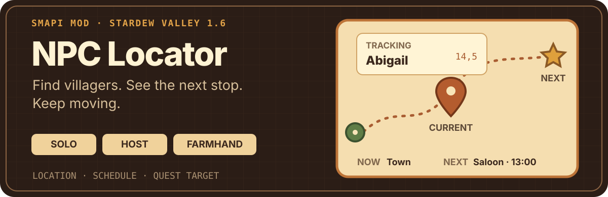
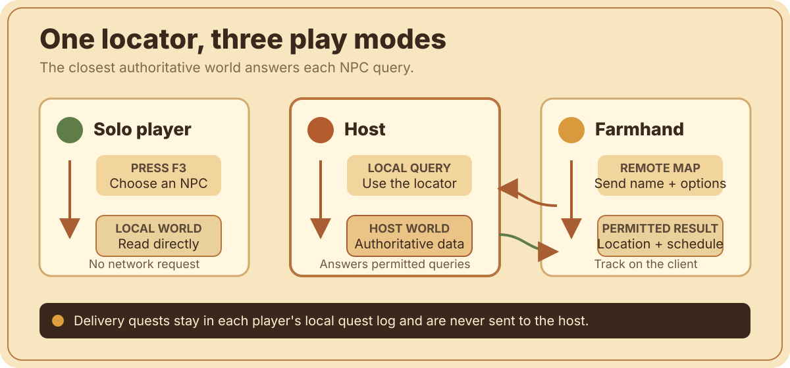

# NPC Locator

<p align="center">
  
</p>

[简体中文](README.zh-CN.md)

NPC Locator is a SMAPI mod for Stardew Valley by March3tar. It shows where an NPC is now, where their standard daily schedule takes them next, and how far away they are when you share a map. It works for solo players, multiplayer hosts, and farmhands.

The mod began as a solution for farmhands who couldn't reliably look up NPCs in multiplayer. It has since grown into a focused locator for everyday visits and item-delivery quests—without teleporting anyone, changing schedules, or writing tracking data to the save.

## What it does

- **Search every villager** by internal or localized display name.
- **See the useful details**: current location, tile coordinates, today's standard schedule, and the next scheduled stop.
- **Track one NPC** in a compact overlay with same-map direction and approximate distance.
- **Follow delivery targets** from active standard item-delivery quests, including the required and currently held item counts.
- **Work across multiplayer maps** using host-authoritative location and schedule data.
- **Stay out of the save**: tracking lasts only for the current game session and never changes NPC behavior or quests.

NPC Locator is independent from Lookup Anything and doesn't require it.

## In game

These screenshots come from real testing: the spring captures are from a solo save, while the autumn captures are from a multiplayer save. The game UI is shown in Simplified Chinese; click any image to open the original 4K capture.

<a href="./pictures/singleplayer-spring-npc-search-and-schedule.jpg">
  
</a>

*Search an NPC and inspect their current location, coordinates, and standard schedule in a spring solo save.*

<a href="./pictures/multiplayer-autumn-tracker-direction-distance.jpg">
  
</a>

*Keep a remote NPC visible with their current location, next stop, direction, and approximate distance in an autumn multiplayer save.*

<a href="./pictures/singleplayer-spring-delivery-quest-details.jpg">
  
</a>

*Browse a standard item-delivery quest and start tracking its target from a spring solo save.*

<details>
<summary>More testing screenshots</summary>

### Delivery quest prompt · solo / spring

<a href="./pictures/singleplayer-spring-delivery-quest-prompt.jpg">
  
</a>

### Tracker on the farm · multiplayer / autumn

<a href="./pictures/multiplayer-autumn-tracker-farm.jpg">
  
</a>

### Tracker in town · solo / spring

<a href="./pictures/singleplayer-spring-tracker-town.jpg">
  
</a>

</details>

## Requirements

- Stardew Valley 1.6.15 or later in the 1.6 line;
- SMAPI 4.5.2 or later;
- Windows is the tested platform for version 0.1.0;
- Generic Mod Config Menu (GMCM) is optional.

For a farmhand to locate NPCs on remote maps, both the host and that farmhand must install the same compatible version. Solo players and hosts read their local world directly.

## Quick start

1. Install [SMAPI](https://smapi.io/).
2. Extract the release archive into Stardew Valley's `Mods` folder.
3. Confirm the resulting path is `Mods/NpcLocator/manifest.json`.
4. Launch the game through SMAPI and press `F3`.

To update, replace only the existing `NpcLocator` folder with the one from the new archive.

If you installed a pre-release build named `MultiplayerNpcLocator`, optionally back up its `config.json`, delete the old folder, and then install `NpcLocator`. Don't keep both folders: they use different UniqueIDs and SMAPI may load both. You can copy the backed-up configuration into the new folder afterward.

## Using the locator

### NPC search

Open the locator with `F3`, search for a villager, and select them to view their current location and standard schedule for today. You can refresh the result or begin tracking them. When the game language is Chinese, localized names are sorted by pinyin, followed by English fallback names.

### Delivery quests

The **Delivery quests** tab lists active standard item-delivery quests from your own quest log. Select a quest to inspect its target, item, required and held counts, and deadline, or begin tracking its target. You can return to this tab later to reconnect quest-linked tracking.

### Tracker overlay

While the `F3` menu is open, tracking status appears inside the menu. After it closes, the compact tracker returns to the configured screen corner.

The tracker shows the current location and next scheduled stop with aligned location and coordinate columns. When you and the NPC are on the same map, it also shows approximate straight-line direction and distance. Hover over the top-right `×` and click it to stop tracking without reopening the menu.

Tracking is session-only. It is cleared when you return to the title screen and isn't written to the game save.

## Configuration

With GMCM installed, you can configure:

- the menu key;
- delivery quest detection;
- tracker visibility, position, opacity, next stop, direction, and distance;
- host controls for remote queries, current locations, daily schedules, notifications, and request rate limits.

Without GMCM, launch the game once and edit the generated `config.json` in the mod folder. SMAPI can't reliably detect every key conflict, so change the default `F3` binding if another mod also uses it.

## Multiplayer and privacy

The host is the authority for NPC locations and schedules. A farmhand sends only the selected NPC's stable internal name and query options, and the host returns only the permitted locator result.

Delivery quests are read exclusively from each player's local quest log and are never sent to the host. NPC Locator doesn't execute client-provided code, read arbitrary files, teleport players, alter schedules, modify quests, or persist tracking state in the save.

<p align="center">
  
</p>

## Known limitations

- Festivals, cutscenes, weddings, scripted events, and other mods can temporarily control or remove an NPC. The locator reports that state as unavailable instead of trying to predict it.
- Locked characters can appear in the full NPC list before their world instance exists. For example, Leo may be listed before Ginger Island progression but remain unavailable.
- Version 0.1.0 recognizes standard `ItemDeliveryQuest` entries only. It doesn't infer special orders, multi-target quests, or custom quest types.
- The first release officially targets vanilla NPCs. Custom NPCs and maps may fall back to internal names or lack a standard schedule.
- Direction and distance are straight-line estimates, not pathfinding, and don't account for walls, doors, or warps.

See [Known limitations](docs/KNOWN_LIMITATIONS.md) for the complete list.

## Building on Windows

From the source directory:

```powershell
powershell.exe -NoProfile -ExecutionPolicy Bypass -File .\scripts\Build-Windows.ps1 -Install -UpdateExisting -Package
```

Use `-GamePath 'D:\SteamLibrary\steamapps\common\Stardew Valley'` if the game isn't in the default Steam library. `-Package` creates the installable archive under `dist`.

## Documentation

- [简体中文说明](README.zh-CN.md)
- [Changelog](CHANGELOG.md)
- [Known limitations](docs/KNOWN_LIMITATIONS.md)
- [Final validation checklist](docs/PHASE5_VALIDATION.md)
- [Development plan](docs/DEVELOPMENT_PLAN.md)
