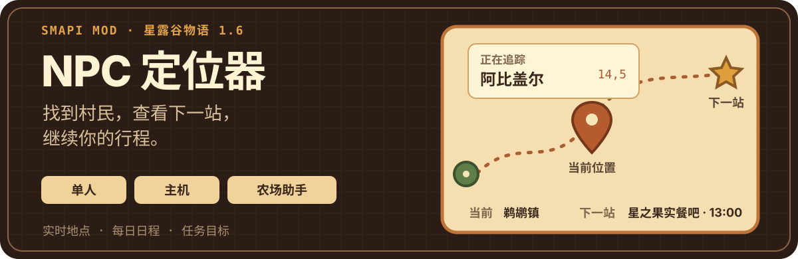
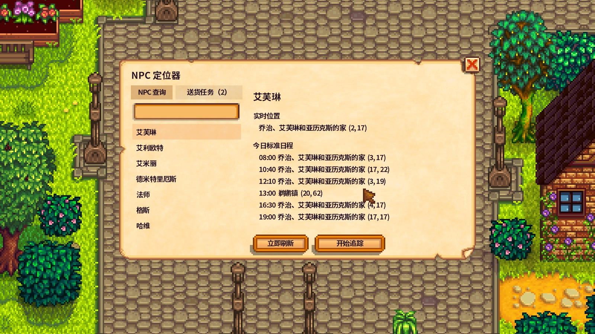
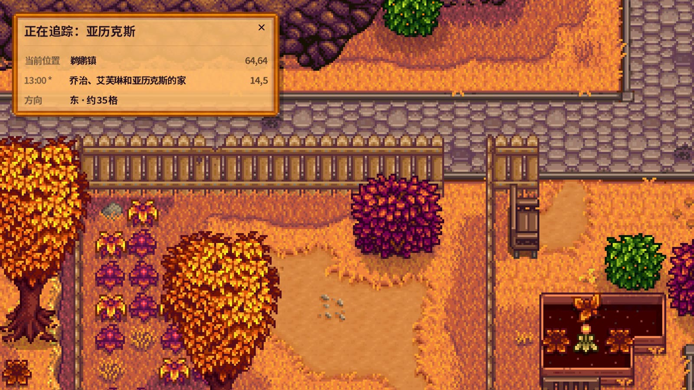
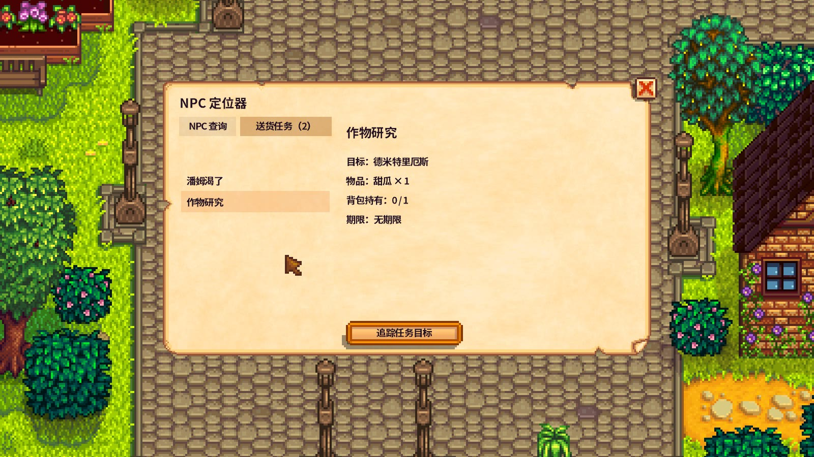
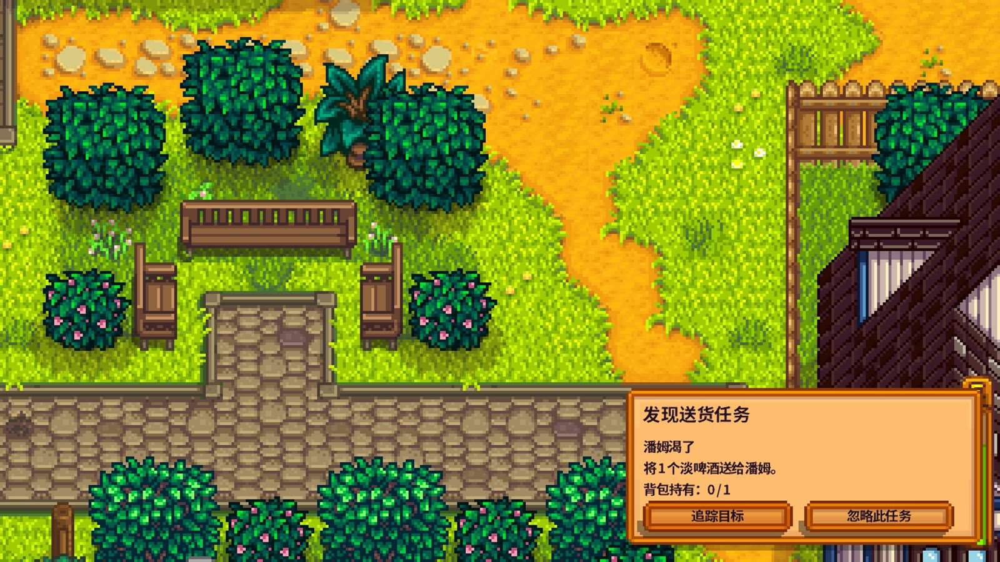
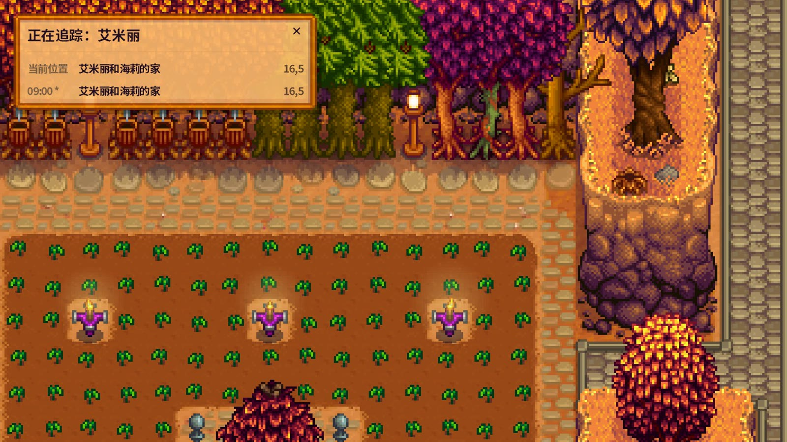
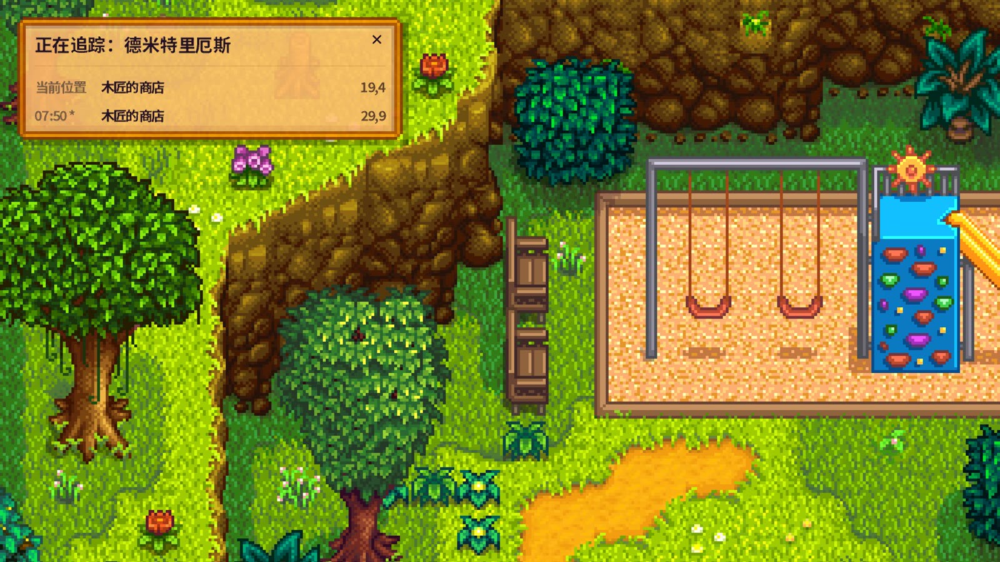
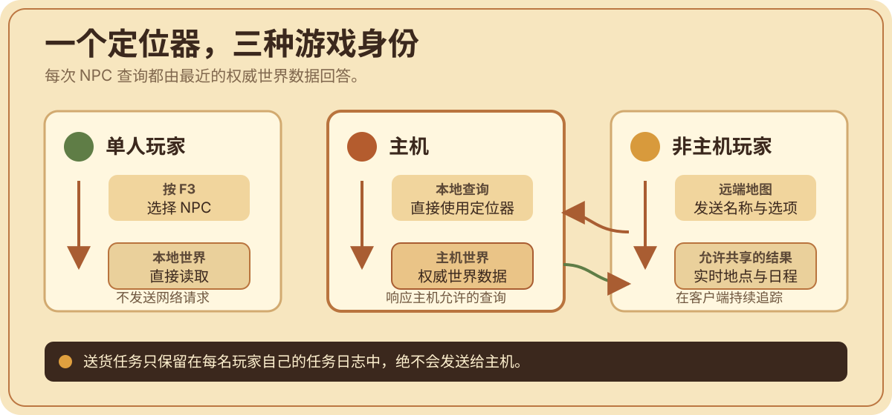

# NPC 定位器

<p align="center">
  
</p>

[English](README.md)

“NPC 定位器”是 Mercury 为《星露谷物语》制作的一款 SMAPI Mod。它能显示 NPC 当前所在地点、今日标准日程的下一站，以及玩家与 NPC 同地图时的大致方向和距离；单人玩家、联机主机和农场助手均可使用。

这个 Mod 最初用于解决农场助手在联机游戏中无法可靠查询 NPC 的问题，后来逐步扩展为适合日常拜访与物品交付任务的完整定位工具。它不会传送角色、修改 NPC 日程或任务，也不会把追踪状态写入存档。

## 主要功能

- **搜索全部村民**：支持内部名和本地化显示名。
- **查看实用信息**：实时地点、格子坐标、今日标准日程和下一站。
- **追踪一名 NPC**：通过紧凑追踪栏持续查看目标；同地图时还会显示方向和大致距离。
- **追踪送货目标**：识别活动中的标准物品交付任务，并显示需求数量与背包持有数量。
- **支持联机远端地点**：以主机的 NPC 位置和日程作为权威数据源。
- **不改写存档**：追踪只在当前游戏会话中有效，不会改变 NPC 行为或任务。

“NPC 定位器”独立于 Lookup Anything，无需安装后者。

## 游戏内效果

以下截图均来自实际测试：春季截图来自单人存档，秋季截图来自联机存档。点击图片可打开原始 4K 截图。

<a href="./pictures/singleplayer-spring-npc-search-and-schedule.jpg">
  
</a>

*在春季单人存档中查询 NPC，查看其实时地点、坐标和标准日程。*

<a href="./pictures/multiplayer-autumn-tracker-direction-distance.jpg">
  
</a>

*在秋季联机存档中持续追踪远端 NPC，查看当前位置、下一站、方向和大致距离。*

<a href="./pictures/singleplayer-spring-delivery-quest-details.jpg">
  
</a>

*在春季单人存档中浏览标准物品交付任务，并开始追踪任务目标。*

<details>
<summary>查看更多测试截图</summary>

### 送货任务提示 · 单人 / 春季

<a href="./pictures/singleplayer-spring-delivery-quest-prompt.jpg">
  
</a>

### 农场追踪栏 · 联机 / 秋季

<a href="./pictures/multiplayer-autumn-tracker-farm.jpg">
  
</a>

### 城镇追踪栏 · 单人 / 春季

<a href="./pictures/singleplayer-spring-tracker-town.jpg">
  
</a>

</details>

## 运行要求

- Stardew Valley 1.6.15 或更新的 1.6.x 版本；
- SMAPI 4.5.2 或更高版本；
- 0.1.0 私人测试版已验证平台为 Windows；
- Generic Mod Config Menu（GMCM）为可选依赖。

农场助手如需定位远端地图中的 NPC，主机与该农场助手必须安装同一个兼容版本。单人玩家和主机会直接读取自己的本地世界数据。

## 快速开始

1. 安装 [SMAPI](https://smapi.io/)。
2. 将发布包解压到《星露谷物语》的 `Mods` 文件夹。
3. 确认最终路径为 `Mods/NpcLocator/manifest.json`。
4. 通过 SMAPI 启动游戏，然后按 `F3`。

更新时，只需用新发布包中的 `NpcLocator` 文件夹替换原文件夹。

如果安装过名为 `MultiplayerNpcLocator` 的更名前测试版，可以先备份其中的 `config.json`，删除旧文件夹，再安装 `NpcLocator`。请勿同时保留两个文件夹：它们使用不同的 UniqueID，SMAPI 可能会同时加载。安装完成后，可将备份配置复制到新文件夹。

## 使用方法

### NPC 查询

按 `F3` 打开定位器，搜索并选择村民，即可查看其实时地点和今日标准日程。你可以手动刷新查询结果或开始追踪。游戏语言为中文时，本地化人物名会按拼音排列，缺少中文显示名的英文回退项排在其后。

### 送货任务

**送货任务**分页会列出你自己的任务日志中仍在进行的标准物品交付任务。选择任务即可查看目标 NPC、所需物品、需求与持有数量和期限，也可以开始追踪任务目标。之后即使手动改追其他 NPC，仍可返回该分页重新建立任务关联。

### 追踪栏

打开 `F3` 窗口时，当前追踪状态会显示在窗口内；窗口关闭后，紧凑追踪栏会回到配置的屏幕角落。

追踪栏会以对齐的地点与坐标列显示当前位置和下一站。玩家与 NPC 位于同一张地图时，还会显示直线估算的方向和距离。将鼠标移到右上角的 `×` 并点击，即可直接停止追踪，无需重新打开菜单。

追踪仅在当前游戏会话中保留；返回标题画面后会被清除，不写入游戏存档。

## 配置

安装 GMCM 后，可在游戏内设置：

- 打开定位器的快捷键；
- 是否识别送货任务；
- 追踪栏显示、位置、透明度、下一站、方向和距离；
- 主机远程查询、实时位置、每日标准日程、通知与请求频率上限。

未安装 GMCM 时，先启动一次游戏，然后编辑 Mod 文件夹内自动生成的 `config.json`。SMAPI 无法可靠检测所有快捷键冲突；如果其他 Mod 也使用 `F3`，请修改其中一个绑定。

## 联机机制与隐私

NPC 位置和日程以主机的数据为准。农场助手只会发送所选 NPC 的稳定内部名和查询选项，主机也只会返回其设置允许共享的定位结果。

送货任务只从每名玩家自己的本地任务日志中读取，绝不会发送给主机。“NPC 定位器”不接受客户端任意代码或文件路径，不传送玩家，不改写 NPC 日程或任务，也不会在存档中保存追踪状态。

<p align="center">
  
</p>

## 已知限制

- 节日、过场、婚礼、脚本事件或其他 Mod 可能暂时控制或移除 NPC。定位器会如实显示当前状态不可用，不会尝试预测。
- 未解锁角色可能提前出现在完整 NPC 名单中。例如姜岛进度前可以列出 Leo，但暂时无法定位。
- 0.1.0 只识别标准 `ItemDeliveryQuest`，不会推断特殊订单、多目标任务或自定义任务类型。
- 首个版本正式面向原版 NPC。自定义 NPC 和地图可能回退到内部名，或没有标准日程。
- 方向和距离是直线估算而非寻路，不考虑墙壁、门和传送点。

完整说明请查看[已知限制](docs/KNOWN_LIMITATIONS.md)。

## Windows 源码构建

在源码目录执行：

```powershell
powershell.exe -NoProfile -ExecutionPolicy Bypass -File .\scripts\Build-Windows.ps1 -Install -UpdateExisting -Package
```

如游戏不在 Steam 默认库，添加 `-GamePath 'D:\SteamLibrary\steamapps\common\Stardew Valley'`。`-Package` 会在 `dist` 中生成可安装压缩包。

## 文档

- [English README](README.md)
- [更新日志](CHANGELOG.md)
- [已知限制](docs/KNOWN_LIMITATIONS.md)
- [最终验收清单](docs/PHASE5_VALIDATION.md)
- [开发计划](docs/DEVELOPMENT_PLAN.md)
